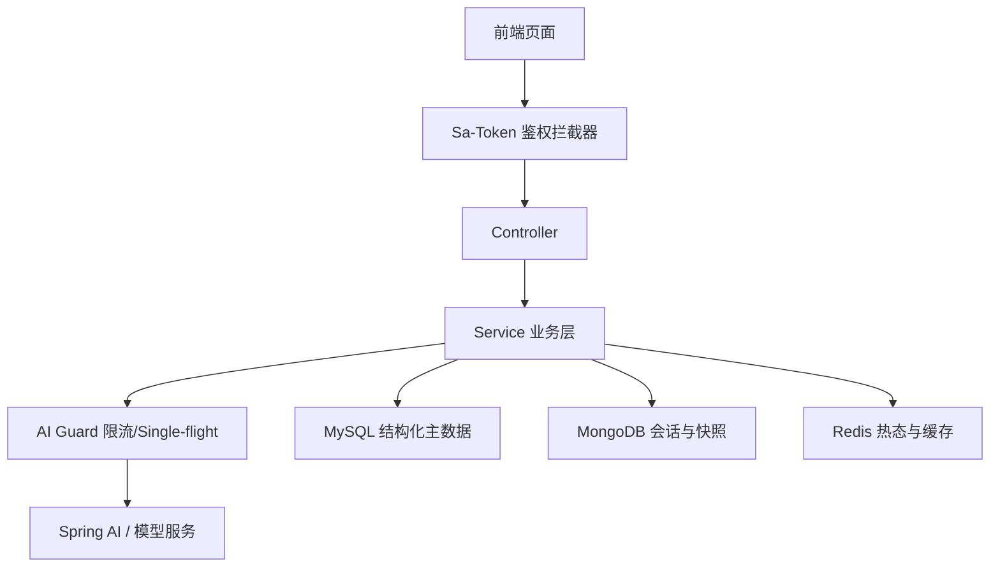
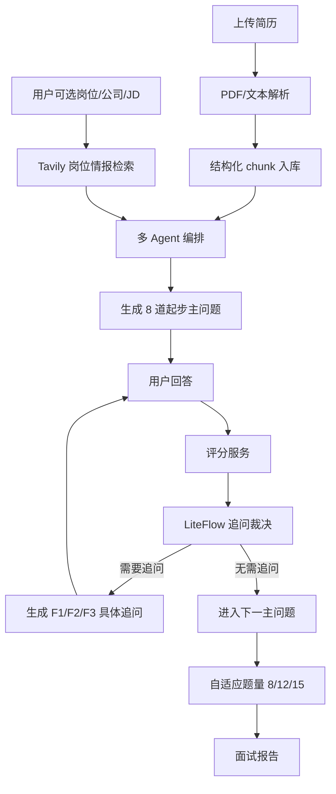

# 架构说明

本文档说明 MyAI-Meeting-Backend 的模块划分、数据流和核心设计边界，方便后续维护和面试讲解。

## 总体分层

```text
com.zsj.meetingagent
├── common              通用响应、异常和健康检查
├── config              CORS、Sa-Token、WebSocket、数据库初始化等配置
├── auth / user         登录注册、登录态、用户资料和 MySQL 用户存储
├── ai                  大模型同步调用、模型配置和 Prompt 入口
├── chat                AI 会话、消息、SSE 流式响应和 MongoDB 快照
├── agent               Thought-Action-Observation、工具调用、多 Agent 角色和 trace
├── resume              简历上传、PDF/文本解析、原始文件预览
├── interview           面试会话、题目生成、追问、评分、报告和运行时恢复
├── knowledge / rag     知识文档、结构化 chunk、召回、rerank 和 evidence
├── evaluation          对照实验、指标统计和报告生成
├── limit               Redis 限流、Single-flight、超时和降级
├── media / websocket   ASR/TTS 降级链路和 WebSocket 语音转写
└── frontendadapter     旧前端接口兼容层
```

## 请求主链路



## 模拟面试链路



## 数据存储边界

| 数据类型 | 存储 | 原因 |
| --- | --- | --- |
| 用户、简历元数据、面试记录、知识文档、评测记录 | MySQL | 结构清晰、适合查询和中文 COMMENT |
| 聊天消息、Agent trace、面试题快照、运行时快照 | MongoDB | 长文本和半结构化字段较多，适合快照保存 |
| 登录态、限流计数、AI 调用锁、运行时热态 | Redis | 读写快，适合带过期时间的临时状态 |

## 当前工程边界

- RAG 暂未接入向量数据库，`knowledge_chunk` 已预留后续 embedding/vector 字段扩展空间。
- TTS 音频下载 URL 目前按 taskId 公开，适合本地降级和前端联调；生产环境应改为短期签名 URL。
- WebSocket 支持 token 参数鉴权，真实 ASR 供应商接入时只需要替换 `AudioTranscriptionService` 实现。
- 旧前端路径仍由 `frontendadapter` 适配，核心业务代码不放旧路径命名。

