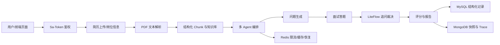

# 项目面试讲解手册

这份文档用于把 `MyAI-Meeting-Backend` 讲成一个能经得起追问的后端项目。表达时要站在“Java 后端实习生 + AI Agent 项目实践者”的角度，重点讲清楚业务闭环、技术选型、数据流、可量化评估和当前边界。

## 1. 一分钟项目介绍

我做的是一个 AI 模拟面试 Agent 后端项目，目标是帮助用户上传简历后进行 Java 后端方向的模拟面试。项目支持登录注册、AI 对话、SSE 流式输出、简历解析、岗位/JD 可选输入、公开岗位情报检索、多 Agent 协同出题、LiteFlow 追问裁决、MongoDB 会话快照、Redis 限流和长会话恢复，还做了 evaluation 模块统计回答命中率、幻觉率、证据引用准确率和响应时间。

这个项目不是简单调大模型接口。我重点做了三件事：

1. 把面试流程拆成后端可维护的业务状态机和多 Agent 编排。
2. 用结构化 chunk、rerank、证据引用和自检机制降低模型乱答。
3. 用 MySQL、MongoDB、Redis 分别承担结构化业务数据、长文本快照和高频状态缓存，让系统更像真实后端工程。

## 2. 简历项目经历写法

可以写成：

```text
MyAI-Meeting-Backend｜AI 模拟面试 Agent 后端系统

- 基于 Spring Boot 3、Sa-Token、Spring AI、MyBatis、MongoDB、Redis 实现 AI 模拟面试后端，支持登录注册、SSE 流式对话、简历上传、岗位/JD 可选输入、面试出题、追问评分、报告生成和历史记录。
- 设计多 Agent 协同流程，将简历分析、岗位情报、问题设计、回答评分和总结报告拆分为独立角色，并将 Agent run 和 step trace 持久化到 MongoDB，便于排查模型决策过程。
- 使用 LiteFlow 实现追问裁决规则链，将低分判断、缺失考点、AI 建议和追问次数限制从业务代码中拆出；追问问题由专用生成器结合简历、题目、回答和前序追问链生成，避免泛问。
- 设计简历/JD 结构化 chunk、业务 rerank、evidence 引用和回答自检流程，提供 `/api/retrieval/evidence` 和 evaluation 对照实验，用真实测试集统计命中率、幻觉率、引用准确率和响应时间。
- 基于 Redis 实现 AI 调用限流、Single-flight、超时降级和会话热态缓存；基于 MongoDB 保存聊天消息、面试运行快照和 Agent trace；基于 MySQL 保存用户、简历、面试记录和评测报告。
```

注意：如果没有实际跑出正式评测报告，不要写“幻觉率从 X 降到 Y”。只能写“实现了 evaluation 模块，可统计这些指标”。

## 3. 整体架构怎么讲

可以按这条主线讲：



讲解顺序：

1. 用户先通过 Sa-Token 登录，前端请求带 `Authorization: Bearer token`。
2. 用户上传简历，后端用 PDFBox 提取文本，并保存简历文件和业务记录。
3. 如果用户填写岗位、公司或 JD，后端才触发 Tavily 岗位情报检索；如果用户不填，就只基于简历出题，不默认补岗位。
4. 简历、JD、岗位情报会被拆成结构化 chunk，再通过检索和 rerank 选出 evidence。
5. 多 Agent 协同生成题目、评分和总结，每一步都写入 MongoDB trace。
6. 用户回答后，LiteFlow 规则链判断是否需要追问，专用追问生成器生成具体问题。
7. MySQL 保存结构化业务数据，MongoDB 保存长文本和快照，Redis 保存登录态、限流和热态恢复数据。

## 4. 核心请求流程

### 4.1 登录流程

1. 前端调用 `POST /api/auth/login`。
2. 后端用 BCrypt 校验密码。
3. 登录成功后调用 Sa-Token 签发 token。
4. 前端后续请求携带 `Authorization: Bearer <token>`。
5. MVC 拦截器读取 token，把当前用户绑定到请求上下文。

面试回答：

> 我原来会 JWT + Spring Security，所以这个项目最终改用 Sa-Token。这样两个项目放在简历里可以体现不同认证方案的实践。Sa-Token 负责登录态管理，我在拦截器里兼容了前端原来的 Bearer token 写法。

### 4.2 AI 对话和 SSE 流式输出

1. 普通同步接口 `POST /api/ai/chat` 一次返回完整回答。
2. 流式接口 `POST /api/ai/chat/stream` 使用 `SseEmitter` 分段推送。
3. 如果模型支持真实流式，用户会边生成边看到内容；如果底层是同步模型或降级模式，后端会把完整回答拆成分片发送。
4. 聊天会话和消息写入 MongoDB，便于刷新后恢复历史。

面试回答：

> SSE 本质是服务端保持 HTTP 连接，不断向前端写 event。它比 WebSocket 更适合大模型单向输出，因为前端主要是收模型 token，不需要复杂双向实时通信。

### 4.3 模拟面试流程

1. 用户上传简历，创建面试 session。
2. 后端生成初始题目，默认 8 道主问题。
3. 用户回答后，评分服务先给分和反馈。
4. LiteFlow 判断是否追问。
5. 如果要追问，生成 `F1/F2/F3` 追问；追问不计入主问题数量。
6. 如果不追问，进入下一道主问题。
7. 根据表现动态扩展到 12 或 15 道。
8. 面试结束后生成报告、问答回放和能力雷达。

面试回答：

> 我把“评分”和“是否追问”分开了。评分关注回答质量，LiteFlow 关注流程裁决，比如是否低分、是否缺失关键点、是否超过最大追问次数。这样规则可解释，后续也方便调整。

## 5. 数据库设计怎么讲

### 5.1 MySQL

MySQL 保存结构化主数据：

- 用户账号。
- 上传文件记录。
- 面试记录。
- knowledge document/chunk 元数据。
- evaluation run 和 case result。

原因：这些数据有明确字段、查询条件和业务约束，适合关系型数据库。

### 5.2 MongoDB

MongoDB 保存半结构化长文本：

- 聊天会话和消息。
- Agent run。
- Agent step trace。
- 面试 session 快照。
- 题目快照。
- 运行时恢复快照。

原因：AI 消息、Agent 轨迹、Prompt 输入输出、RAG evidence 都是字段会变化的长文本结构，用 MongoDB 更灵活。

### 5.3 Redis

Redis 保存高频短生命周期状态：

- Sa-Token 登录态。
- AI 调用限流计数。
- Single-flight 锁。
- AI 结果短缓存。
- 面试运行热态。

原因：这些数据需要读写快、过期快，不适合每次都查 MySQL。

## 6. AI Agent 怎么讲

本项目不是把一个 Prompt 写很长，而是把面试流程拆成多个角色：

- 简历分析 Agent：提取项目、技能和风险点。
- 岗位上下文 Agent：结合用户填写的岗位、公司和 JD，必要时引入公开岗位情报。
- 问题设计 Agent：把简历证据和岗位要求转成具体面试题。
- 回答评估 Agent：对候选人回答评分并给出改进建议。
- 总结报告 Agent：汇总整场表现。

每次 Agent 执行都会产生：

- `Thought`：为什么要做这一步。
- `Action`：调用哪个工具或业务能力。
- `Observation`：工具返回了什么。
- `Final Answer`：最终给业务流程的结果。

面试回答：

> Agent 的价值在于把大模型调用变成可追踪的业务流程。每个角色只负责一类任务，结果写入 trace。出错时我可以查 MongoDB 的 agent_step_trace，而不是只看最终一句模型回答。

## 7. RAG 和防幻觉怎么讲

当前 RAG 的定位要说准确：

- 已完成结构化 chunk、本地召回、业务 rerank、evidence 引用和自检。
- 还没有接入 Milvus、pgvector 等真实向量数据库。
- 所以简历里不能写“基于向量数据库实现企业级 RAG”，应该写“设计并实现结构化 chunk + rerank + evaluation 的 RAG 增强链路”。

核心流程：

1. 简历按基本信息、技能栈、项目经历、实习经历等切 chunk。
2. JD 按岗位职责、任职要求、技术栈、加分项切 chunk。
3. 面试知识按题目、参考答案、考察点、追问方向切 chunk。
4. 先召回 topK。
5. 再 rerank。
6. 选 top3 到 top5 作为上下文。
7. 回答必须引用 evidenceId。
8. 证据不足时走低置信度拒答或降级。

## 8. Evaluation 怎么讲

evaluation 模块用来避免“我感觉效果变好了”这种空话。它支持四种策略：

- `baseline`：普通大模型直答。
- `rag_without_rerank`：只做基础检索。
- `rag_with_rerank`：结构化 chunk + rerank。
- `self_check_rag`：chunk + rerank + 自检拒答。

指标：

- `hallucination_rate`：无证据或与标准答案冲突的比例。
- `answer_hit_rate`：回答命中标准答案的比例。
- `citation_accuracy`：引用证据正确比例。
- `avg_latency_ms`：平均响应时间。

面试回答：

> 我不会在没跑报告前写具体百分比。项目里已经内置 21 条中文测试集，也能生成 JSON 和 Markdown 报告。后续如果要写到简历，我会用固定测试集跑出真实数据再引用。

## 9. 稳定性怎么讲

AI 接口很贵，也容易慢，所以项目做了稳定性治理：

- Redis 限流：防止单个用户高频刷模型。
- Single-flight：相同请求并发到来时，只让一个请求真正打模型，其他请求等待或复用结果。
- 超时控制：模型长时间不返回时，给中文降级回答。
- 指标接口：查看 owner/replay/fallback 等调用统计。
- readiness：检查数据库、Redis、AI 配置和测试集是否可用。

面试回答：

> 我把 AI 调用当成外部不稳定依赖处理，而不是普通本地方法。限流保护成本，Single-flight 减少重复调用，超时和降级保证用户至少收到明确提示。

## 10. 面试官可能追问和回答

### Q1：为什么不用 JWT，而用 Sa-Token？

答：我另一个项目已经用 JWT + Spring Security。这个项目改用 Sa-Token，一方面能练习另一套登录态方案，另一方面 Sa-Token 对登录态、踢人、共享 token、Redis 会话更友好。前端仍然用 `Authorization: Bearer token`，后端拦截器兼容解析。

### Q2：MySQL 和 MongoDB 为什么都用？

答：MySQL 用来保存用户、简历文件、面试记录、评测报告这类结构固定、需要关系查询的数据。MongoDB 用来保存 AI 会话、Agent trace、Prompt 输入输出和运行快照，因为这些字段长、结构会演进，用文档模型更灵活。

### Q3：SSE 和 WebSocket 怎么选？

答：AI 文本生成是服务端到客户端的单向持续输出，用 SSE 更轻量，浏览器支持也好。WebSocket 我放在语音转写这类双向实时场景里，因为前端需要持续上传音频帧，后端持续返回事件。

### Q4：你这个 Agent 和普通调用 LLM 有什么区别？

答：普通 LLM 调用是输入一段 Prompt，拿一个回答。我的 Agent 把流程拆成角色、工具、trace 和状态机，例如简历分析、岗位情报、问题设计、评分和总结分别处理，并保存每一步。这样能排查、能复盘、能接入规则和评测。

### Q5：LiteFlow 在这里解决了什么问题？

答：它把“是否追问”的规则链从业务 service 里拆出来。比如是否已完成、追问次数是否超限、回答是否低分、是否缺考点，都可以作为节点执行。大模型负责生成自然语言追问，LiteFlow 负责确定性流程裁决。

### Q6：RAG 现在是不是真向量库？

答：当前不是向量数据库版，而是结构化 chunk + 本地召回 + rerank + evidence 引用。这样先把业务链路和评测闭环跑通。后续可以把召回层替换成 Spring AI VectorStore、pgvector 或 Milvus，evaluation 指标可以继续复用。

### Q7：怎么保证模型不会乱编？

答：第一，Prompt 要求基于 evidence；第二，检索结果带 evidenceId；第三，自检阶段判断是否有证据支撑；第四，evaluation 统计幻觉率和引用准确率；第五，证据不足时允许低置信度拒答。

### Q8：为什么回答“不知道”不能给 60 分？

答：这是我在联调中发现的业务问题。后面把评分规则独立出来，拒答、空答、明显无效答直接低分或 0 分，不再走默认及格分；同时触发追问或进入下一题由 LiteFlow 判断。

### Q9：项目最大难点是什么？

答：不是调通一个大模型接口，而是把 AI 的不确定性放进后端工程里管理。比如模型可能慢、可能空输出、可能格式不合法、可能追问太泛，所以我加了结构化 JSON、兜底规则、输出校验、Redis Guard、MongoDB trace 和 evaluation。

### Q10：现在还有哪些边界？

答：真实 ASR/TTS 供应商、OCR、向量数据库和深度 reranker 还没有接入；当前媒体是降级闭环，RAG 是本地检索版。README 已明确这些边界，避免简历夸大。

## 11. 现场演示建议

演示前按这个顺序：

1. 启动 MongoDB、Redis、MySQL。
2. 启动后端。
3. 调 `GET /api/system/readiness`。
4. 登录前端。
5. 上传文本型 PDF 简历。
6. 不填岗位做一轮，只看简历出题。
7. 再填公司、岗位和 JD 做一轮，看题目差异。
8. 对某题回答“不知道”，观察低分和追问。
9. 对某题回答具体技术方案，观察反馈和是否进入下一题。
10. 打开报告，看问答回放、追问链和分数。
11. 打开 DataGrip，看 MySQL 面试记录和 MongoDB agent trace。

## 12. 不要这么讲

不要说：

- “我实现了企业级向量数据库 RAG。”
- “我接入了讯飞实时语音识别。”
- “我的幻觉率降低了 80%。”
- “这个项目完全复刻原项目。”

应该说：

- “当前 RAG 是结构化 chunk + rerank + evidence 引用，向量库是后续替换点。”
- “当前语音链路完成 WebSocket 鉴权和降级闭环，真实供应商可以替换 service 实现。”
- “指标必须来自 evaluation 报告，没跑正式数据前不写具体百分比。”
- “参考了原项目功能方向，但包名、接口风格、Prompt、目录结构和项目亮点是我自己重构的。”
